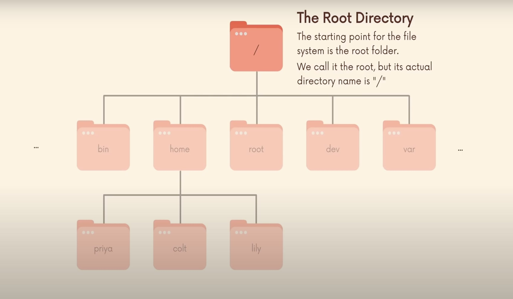
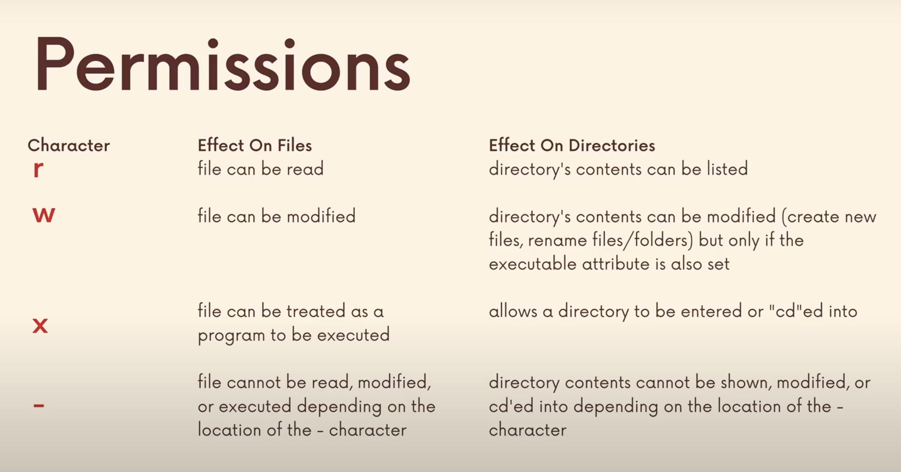

# LINUX AND TERMINAL COMMANDS

**_Why learn these commands?_**

- More control over the machine
- Faster
- Can automate many tasks
- Available almost everywhere
- Requirement in engineering field
- Needed for cloud computing

Terminal → Shell → OS

## Commands:


1. `whoami` : Print username of currently logged in user

2. `man <command>` : To get manual

   - To exit: type q
   - To jump to start : g
   - To jump to end : shift+g

3. `clear` : or ctrl+L

4. `pwd` : Print working directory

5. `ls` : List contents of the folder

   ls -a -> To view even files whose name starts with a .

   ls -l -> To view details about files

6. `cd <directory-name>` : Change directory

   - .. : refers to parent folder
   - ~ : refers to home folder of current user
   - / : refers to root directory of system

   

7. `mkdir <directory-name> <directory-name>...` : Make directory

   `mkdir p <directory-path>` -> To create nested directories

8. `touch <filename> <filename>...` : Create empty files/ change file timestamps

9. `rmdir <directory-path>` : Deletes an empty directory

10. `rm <filename/directory-path>` : Delete files/directories

    - -v : Gives a description of the action performed(verbose)
    - -r : Performs recursive actions
    - -i : Interactive actions

    Eg: rm -rv Projects

11. `open <filename>` : Opens file/directory on mac

    - xdg-open <filename> : Opens file on linux

12. `mv <filename/directory-name> <destination>` : Move files/folders around

13. `cp <name-of-original> <path/name-of-copy>` : Make a copy of files

    `cp -r <folder-name> <path/name-of folder-copy>` -> Make a copy of folders

14. `head <filename>` : Outputs the first part of a file

    `head/tail <filename> -n <no-of-lines>` -> To print a specific number of lines

15. `tail <filename>` : Outputs the first part of a file
    `tail -f <filename>` -> Keep printing last lines and any further updates until stopped (useful to monitor log files)

16. `date` : To print current date and time

```
 Redirection :
To redirect the date to a file: date > filename

To redirect something to file by appending and not rewriting, use ‘>>’ instead of ‘>’
```

17. `cat <filename> <filename>...` : To concatenate(only on terminal)/Print the entire contents of the file

    `cat <filename> -n` -> To print line numbers

18. `less <filename>` : To provide a better interface to view contents of a file; does not clutter the terminal

19. `echo “content”`: Prints content to terminal; can also be used to insert content into a file without opening it using redirection

20. `wc <filename>` : prints the number of lines, words and bytes in the file

```
Piping :
Taking the output of one command and giving as an input to another directly

* ls -l | wc → This prints the number of lines, words and bytes in the output of list command

* cat butcher.txt groceries.txt | wc -l → returns the number of lines while concatenating these files
```

21. `sort <filename>` : Prints the contents of the file sorted alphabetically, but does not alter the file itself

    `sort -n <filename>` -> To sort numerically

    `sort -nr <filename>` -> To sort in a numerically reverse order

    `sort -nu <filename>` -> To sort the unique numbers numerically

22. `uniq <filename>` : Removes adjacent repeated lines

    `uniq -d <filename>` -> To identify duplicates

    `uniq -u <filename>` -> To identify non duplicates

    `uniq -c <filename>` -> To find the count of each line

```
Expansions :

echo ~ → prints the home directory address
echo * → prints the name of all files in directory
echo $USER → prints the name of the user
echo *.?? → prints the name of all files that have 2 character extensions
touch app.{js,html,css,py} → creates files app.js, app.html, app.css, app.py
echo {1..99} → prints numbers 1 to 99
rm F.* → deletes all files that starts with ‘F’
```

23. `diff <filename> <filename>` : Shows the difference between two files

24. find : Used to find files or folders matching a particular pattern

    find <foldername> -name ‘7’ → searches for a file in specified folder whose name is 7

    find . -name ‘_7_’ → searches for a file in the current directory whose name contains 7

    find . -type d -name ‘_E_ → searches for directories whose name contains ‘E’

    find . -name ‘E*’ -or -name ‘F*’ → searches for files or directories whose name starts with ‘E’ or ‘F’

    find . -type f -size +100k → searchs for files that have size greater than 100kb

    find . -type f -exec cat {} \; → searches for files and prints their contents

25. `grep <text-to-be-found> <filename/path>` : Helps find text within files; case sensitive; supports checking using regular expressions

    grep -nC 2 green new.txt → prints the line where green occurs in the file along with 2 lines before and after(context)

    grep -r “chicken” . → Check the entire directory recursively for files containing the word chicken

26. `du <directory-path>` : Shows the disk usage by each file

27. `df <directory-path>` : displays the amount of disk space available on the file system containing each file name argument. If no file name is given, the space available on all currently mounted file systems is shown.

28. `history` : To display history of commands run

    To run a command from history : !<line-number>

29. `ps` : To view process status

    `ps ax` ->To view ALL processes

30. `top` : Display Linux processes sorted by cpu% occupied

    To sort by memory percentage : top o %MEM (o means override)

31. `kill <process-id>` : To stop the running of a process

    kill -l → prints a list of all different kill signals which can be used

    kill -9 <765789> → kills process 765789 using the 9th signal

32. `killall` : To send the kill signal to multiple processes at once

33. `jobs,bg,fg` : jobs is used to check the list of paused jobs

    ctrl+z is used to stop(not terminate) the job

    `bg/fg <index>` → used to resume the jobs in backgroung or foreground

    - & signifies that the process is running in the background

34. `gzip <filename>` : To compress individual files

    gzip -k <filename> → keeps the original file and creates a new zipped file

35. `gunzip <filename>` : To unzip compressed files

    gzip -d <filename> also serves the same purpose of decompression

36. `tar` : Create an archive grouping multiple files into a single file, which can be further used to compress them together

    tar -cf <new-filename>.tar <filename> <filename> <filename> → creates a new file named archive.tar that contains all the contents of the threee files

    tar -xf archive.tar → separates them into their individual files

    tar -czf <new-filename>.tar.gz <filename> <filename> <filename> → group the files together and zips it

    tar -xf <new-filename>.tar.gz → unzips the files

37. `nano <filename>` : Opens the file in the nano editor, which can be used to edit

38. `alias <short>=’<command>’` : Used to create a user specific shortcut for as command

    To keep an alias even after the terminal is closed, add the alias in .bashrc(.zshrc in zshell, .bash_profile in Mac bash)

    - Using “ ”, the variable is resolved at definition time and using ‘ ’, it is resolved at invocation time

    Eg: alias lsthis=”ls $PWD” and alias lscurrrent=’ls $PWD’

39. `xargs` : Takes standard input and turns it into arguments for commands

    `find . -size +1M | ls` → does not list files only having size greater than 1MB. Instead `find . -size +1M | xargs ls -lh` → list files having size>1MB.(This is because ls s not created to accept arguments through piping )

40. `ln` : used to create links(file that is a pointer to another file)

    `ln <original-file> <hardlink-file>` → Creates a hardlink which points to the memory location of the original file

    `ln -s <original-file> <soft/symbolic-link-file>` → creates a soft/symbolic link that points to the file itself

41. `who` : Displays users logged into the system

42. `su <username>` : Switch user; but stays within the home directory of the original user

    `exit` → used to return back to original user

    `su - <username>` → switches user as well as takes you to their home directory

43. `sudo` : To run commands as the root user

44. `passwd` : To change the password of current user

    `sudo passwd <username>` → used to change the password of another user as the root

45. `sudo chown <new-owner> <filename>` : Change ownership

    `sudo chown -R <new-owner> <filename>` → recursively change ownership of folder and files concerned

    `sudo chown <new-owner>:<group> <filename>` → changes the group allowed to read the file




46. `chmod <mode> <filename>` : To change the permissions for a file/directory

    chmod u-w index.txt → revokes the users permission to write to index.txt

    chmod g+x NewFolder → adds executing permissions for the group users

    chmod o-rwx index.txt → revokes all permissions for the world(others)

    chmod a+r index.txt → adds read permission to all users

    chmod a=r index.txt → Sets only the read permission and revokes all others for all users

    Octals can also be used to modify permissions(Eg: chmod 755 file.txt)
